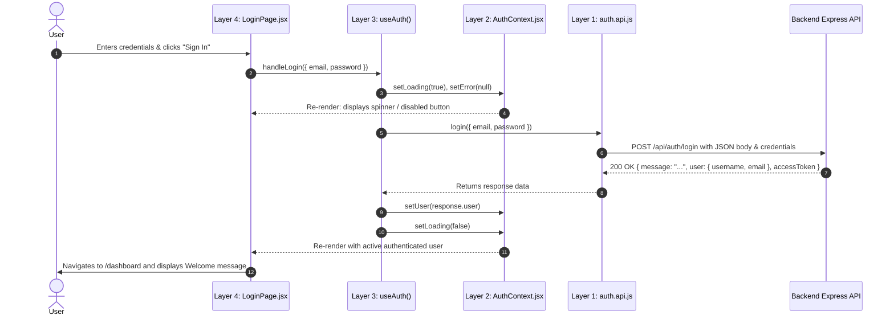

# 4-Layer React Architecture & Wiring Guide

### _Comprehensive Implementation Notes & Mental Models (Auth Case Study)_

---

## 📑 Table of Contents

1. [Core Philosophy & Architecture Overview](#1-core-philosophy--architecture-overview)
2. [Quick Reference: The 4 Layers at a Glance](#2-quick-reference-the-4-layers-at-a-glance)
3. [Folder Structure Patterns](#3-folder-structure-patterns)
4. [Layer 1: API / Service Layer (`auth.api.js`)](#4-layer-1-api--service-layer)
5. [Layer 2: Context / State Layer (`AuthContext.jsx`)](#5-layer-2-context--state-layer)
6. [Layer 3: Custom Hook Layer (`useAuth.js`)](#6-layer-3-custom-hook-layer)
7. [Layer 4: UI Component Layer (`LoginPage.jsx`, `RegisterPage.jsx`)](#7-layer-4-ui-component-layer)
8. [Wiring Everything Together in the Application Root](#8-wiring-everything-together-in-the-application-root)
9. [Complete End-to-End Data Flow Lifecycle](#9-complete-end-to-end-data-flow-lifecycle)
10. [Critical Gotchas & Traps (Learned from Debugging)](#10-critical-gotchas--traps-learned-from-debugging)
11. [Context vs TanStack Query (Client State vs Server State)](#11-context-vs-tanstack-query)
12. [One-Sentence Quick Recall Summary](#12-one-sentence-quick-recall-summary)

---

## 1. Core Philosophy & Architecture Overview

The **4-Layer Architecture** solves the #1 problem in React applications: **Spaghetti Code** (mixing API calls, UI rendering, local state, and global state in one file).

By enforcing **Separation of Concerns**, every layer has exactly one question to answer:

```
┌────────────────────────────────────────────────────────┐
│                   UI / Component Layer                 │ ── "What does the user see?"
│             (LoginPage.jsx, RegisterPage.jsx)          │
└───────────────────────────┬────────────────────────────┘
                            │ uses hook
┌───────────────────────────▼────────────────────────────┐
│                    Custom Hook Layer                   │ ── "How does the UI interact with state & logic?"
│                      (useAuth.js)                      │
└─────────────┬────────────────────────────┬─────────────┘
              │ reads / writes             │ calls
┌─────────────▼─────────────┐   ┌──────────▼─────────────┐
│    Context / State Layer  │   │   API / Service Layer  │ ── "Where is shared state stored?"
│     (AuthContext.jsx)     │   │      (auth.api.js)     │ ── "How do we talk to the backend?"
└───────────────────────────┘   └──────────┬─────────────┘
                                           │ HTTP (Axios)
                                ┌──────────▼─────────────┐
                                │   Backend Express API  │
                                └────────────────────────┘
```

### The Unidirectional Data Flow

1. **User Action**: User types and clicks "Sign In" in the **Component Layer**.
2. **Hook Execution**: Component delegates the action to a handler in the **Custom Hook Layer** (`handleLogin`).
3. **HTTP Dispatch**: The Hook calls the **API Layer** (`login({ email, password })`), setting `loading = true`.
4. **Backend Processing**: Express handles the request, queries MongoDB, verifies credentials, and returns JSON.
5. **State Mutation**: The Hook receives the data and updates the **Context Layer** (`setUser(response.user)`).
6. **Re-render**: Context notifies subscribed components, triggering a clean re-render with updated state.

---

## 2. Quick Reference: The 4 Layers at a Glance

| Layer                        | File in this Project                | Key Question               | What Goes IN                                                                                 | What Stays OUT                                      |
| :--------------------------- | :---------------------------------- | :------------------------- | :------------------------------------------------------------------------------------------- | :-------------------------------------------------- |
| **Layer 4: UI / Component**  | `LoginPage.jsx`, `RegisterPage.jsx` | _"What to display?"_       | JSX, HTML forms, input state (`useState`), event triggers (`onSubmit`, `onClick`)            | `axios`, endpoints, `jwt`, business validation      |
| **Layer 3: Custom Hook**     | `useAuth.js`                        | _"What should UI do?"_     | Try/catch, orchestration, calling API, mutating Context, local loading/error                 | JSX, direct raw Axios config, database schema       |
| **Layer 2: Context / State** | `AuthContext.jsx`                   | _"Where is state stored?"_ | Shared state (`user`, `loading`, `error`), state setters, `createContext`, custom guard hook | Direct API calls, UI logic, complex transformations |
| **Layer 1: API / Service**   | `auth.api.js`                       | _"How to talk to server?"_ | `axios` instance, endpoints (`/login`, `/register`), payload params, error unwrapping        | `useState`, `useEffect`, React hooks, UI code       |

---

## 3. Folder Structure Patterns

### A. Layer-Based Structure (Current Project)

Great for small to medium apps:

```
client/src/
├── context/
│   └── AuthContext.jsx       # Layer 2: State storage
├── hooks/
│   └── useAuth.js            # Layer 3: Orchestration
├── pages/
│   ├── LoginPage.jsx         # Layer 4: UI
│   └── RegisterPage.jsx      # Layer 4: UI
├── services/
│   └── auth.api.js           # Layer 1: API Communication
├── App.jsx
└── main.jsx
```

### B. Feature-Based Structure (Scales to Large Apps)

Recommended for enterprise apps where each feature is self-contained:

```
client/src/
├── features/
│   └── auth/
│       ├── api/
│       │   └── auth.api.js         # Layer 1
│       ├── context/
│       │   └── AuthContext.jsx     # Layer 2
│       ├── hooks/
│       │   └── useAuth.js          # Layer 3
│       ├── components/
│       │   ├── LoginForm.jsx       # Layer 4
│       │   ├── RegisterForm.jsx    # Layer 4
│       │   └── AuthCard.jsx        # Layer 4
│       ├── pages/
│       │   ├── LoginPage.jsx
│       │   └── RegisterPage.jsx
│       └── index.js                # Public API of auth feature
├── lib/
│   └── axios.js                    # Global Axios client & interceptors
├── App.jsx
└── main.jsx
```

---

## 4. Layer 1: API / Service Layer

### 📍 Purpose

The API layer is responsible **only** for HTTP communication with the backend. It has zero knowledge of React, components, or UI state.

### 📄 Implementation: `client/src/services/auth.api.js`

```javascript
import axios from 'axios';

// 1. Create configured Axios instance
const api = axios.create({
    baseURL: '/api/auth', // MUST have leading slash for correct routing!
    withCredentials: true, // Crucial: sends HTTP-only cookies (refresh tokens)
});

// 2. Pure Async API functions
export async function login({ email, password }) {
    try {
        const response = await api.post('/login', { email, password });
        return response.data || response?.user;
    } catch (err) {
        console.error('Error while logging in:', err);
        throw err.response?.data || err;
    }
}

export async function register({ username, email, password }) {
    try {
        const response = await api.post('/register', { username, email, password });
        return response.data || response?.user;
    } catch (err) {
        console.error('Error in registration:', err);
        throw err.response?.data || err;
    }
}

export async function getMe() {
    try {
        const response = await api.get('/get-me');
        return response.data || response?.data?.user;
    } catch (err) {
        console.error('Error fetching user profile:', err);
        throw err.response?.data || err;
    }
}
```

### 🧠 Key Rules for Layer 1

1. **Always accept an object payload**: `login({ email, password })` avoids parameter-order confusion.
2. **Never import React**: No `useState`, no `useContext`, no hooks here!
3. **Never handle UI feedback**: Do not call `alert()`, `toast()`, or `navigate()` here.
4. **Always throw or reject errors**: Allow the calling hook (Layer 3) to catch and handle the error gracefully.

---

## 5. Layer 2: Context / State Layer

### 📍 Purpose

Solves **prop drilling**. It holds and exposes the raw global state (`user`, `loading`, `error`) and the dispatchers (`setUser`, `setLoading`, `setError`) to any component in the subtree.

### 📄 Implementation: `client/src/context/AuthContext.jsx`

```jsx
import { useContext, createContext, useState } from 'react';

// 1. Create Context with default value
const AuthContext = createContext(null);

// 2. Provider Component
export const AuthProvider = ({ children }) => {
    const [user, setUser] = useState(null);
    const [loading, setLoading] = useState(false);
    const [error, setError] = useState(null);

    return (
        <AuthContext.Provider value={{ user, setUser, loading, setLoading, error, setError }}>
            {children} {/* CRITICAL: Use {children}, NEVER {{ children }} */}
        </AuthContext.Provider>
    );
};

// 3. Safety Guard Hook
export const useAuthContext = () => {
    const context = useContext(AuthContext);

    if (!context) {
        throw new Error('useAuthContext must be used within an AuthProvider');
    }

    return context;
};
```

### 🧠 Why Have `useAuthContext()` Guard?

Without this guard, if a developer uses the context outside `<AuthProvider>`, `context` will silently be `null` and cause confusing runtime errors like `Cannot destructure property 'user' of null`. The guard provides an immediate, descriptive error message.

---

## 6. Layer 3: Custom Hook Layer

### 📍 Purpose

The **Orchestration Brain**.

- Combines the raw state from **Layer 2 (Context)** with the network actions from **Layer 1 (API)**.
- Handles the complete async lifecycle: `loading -> api call -> success / catch error -> finally reset loading`.
- Exposes clean, high-level action functions to the UI.

### 📄 Implementation: `client/src/hooks/useAuth.js`

```javascript
import { useAuthContext } from '../context/AuthContext';
import { login, register } from '../services/auth.api';

export function useAuth() {
    // 1. Grab raw state & setters from Context
    const { user, setUser, loading, setLoading, error, setError } = useAuthContext();

    // 2. Orchestrate Login
    const handleLogin = async ({ email, password }) => {
        try {
            setLoading(true);
            setError(null);

            // Call Layer 1 API with exact object signature
            const response = await login({ email, password });

            // Update Layer 2 Context state
            setUser(response.user);
            return response;
        } catch (err) {
            const message = err.response?.data?.message || err?.message || 'Login failed';
            setError(message);
            throw err;
        } finally {
            setLoading(false);
        }
    };

    // 3. Orchestrate Registration
    const handleRegister = async ({ username, email, password }) => {
        try {
            setLoading(true);
            setError(null);

            // Call Layer 1 API with exact object signature
            const response = await register({ username, email, password });

            // Update Layer 2 Context state
            setUser(response.user);
            return response;
        } catch (err) {
            const message = err.response?.data?.message || err?.message || 'Registration failed';
            setError(message);
            throw err;
        } finally {
            setLoading(false);
        }
    };

    // 4. Expose clean API for the UI (Layer 4)
    return {
        user,
        loading,
        error,
        handleLogin,
        handleRegister,
    };
}
```

### 🧠 Why Do We Need a Hook if We Already Have Context?

> **Context is for STORAGE. Hook is for OPERATIONS.**

- If you put API calls inside Context, `AuthContext.jsx` becomes massive, bloated, and hard to test.
- The Hook keeps Context slim (just state variables and setters).
- Multiple hooks can share or interact with the same Context differently if needed.

---

## 7. Layer 4: UI Component Layer

### 📍 Purpose

Pure user interface and user experience.

- Renders inputs, labels, and buttons.
- Keeps form input values in lightweight local state (`useState`).
- Listens to user interactions and invokes functions from **Layer 3 (`useAuth`)**.
- Displays loading states and error messages.

### 📄 Implementation: `client/src/pages/LoginPage.jsx`

```jsx
import React, { useState } from 'react';
import { useAuth } from '../hooks/useAuth';
import { Link, useNavigate } from 'react-router-dom';

const LoginPage = () => {
    // Local form state
    const [email, setEmail] = useState('');
    const [password, setPassword] = useState('');

    // Consume Layer 3 Custom Hook
    const { loading, error, handleLogin } = useAuth();
    const navigate = useNavigate();

    async function handleFormSubmit(e) {
        e.preventDefault();
        try {
            await handleLogin({ email, password });
            console.log('Logged In Successfully');
            navigate('/dashboard');
        } catch (err) {
            // Error is already captured in `error` state from hook
            console.error('Login submission failed:', err);
        }
    }

    if (loading) {
        return <div className="text-center py-20 text-white">Loading...</div>;
    }

    return (
        <main className="min-h-screen flex items-center justify-center p-4">
            <div className="border-2 border-neutral-800 bg-neutral-900 rounded-xl p-8 max-w-md w-full">
                <form onSubmit={handleFormSubmit} className="space-y-4">
                    <h1 className="text-2xl font-bold text-white text-center">Login</h1>

                    {error && (
                        <div className="p-3 bg-red-950 border border-red-800 text-red-300 rounded-lg text-sm">
                            {error}
                        </div>
                    )}

                    <div>
                        <label htmlFor="email" className="block text-sm text-neutral-400 mb-1">
                            Email
                        </label>
                        <input
                            id="email"
                            type="email"
                            value={email}
                            onChange={(e) => setEmail(e.target.value)}
                            placeholder="Enter your email"
                            required
                            className="w-full bg-neutral-800 border border-neutral-700 rounded-lg p-2.5 text-white"
                        />
                    </div>

                    <div>
                        <label htmlFor="password" className="block text-sm text-neutral-400 mb-1">
                            Password
                        </label>
                        <input
                            id="password"
                            type="password"
                            value={password}
                            onChange={(e) => setPassword(e.target.value)}
                            placeholder="Enter your password"
                            required
                            className="w-full bg-neutral-800 border border-neutral-700 rounded-lg p-2.5 text-white"
                        />
                    </div>

                    <button
                        type="submit"
                        disabled={loading}
                        className="w-full bg-blue-600 hover:bg-blue-700 text-white font-medium py-2.5 rounded-lg transition"
                    >
                        {loading ? 'Signing in...' : 'Sign In'}
                    </button>

                    <p className="text-sm text-neutral-400 text-center">
                        Don't have an account?{' '}
                        <Link to="/register" className="text-blue-400 hover:underline">
                            Sign up
                        </Link>
                    </p>
                </form>
            </div>
        </main>
    );
};

export default LoginPage;
```

### 🧠 Notice What the Component DOES NOT Know:

- It does **not** know what HTTP method is used (POST, PUT).
- It does **not** know the backend URL endpoint (`/api/auth/login`).
- It does **not** know about `axios` or headers or cookies.
- It only knows: _"When form submits, call `handleLogin({ email, password })` and show `loading` / `error`"_.

---

## 8. Wiring Everything Together in the Application Root

For Context to be available to all pages and routes, `<AuthProvider>` must wrap the application inside `main.jsx` (or `App.jsx`).

### 📄 `client/src/main.jsx`

```jsx
import { StrictMode } from 'react';
import { createRoot } from 'react-dom/client';
import { BrowserRouter } from 'react-router-dom';
import { AuthProvider } from './context/AuthContext.jsx';
import App from './App.jsx';
import './index.css';

createRoot(document.getElementById('root')).render(
    <StrictMode>
        <BrowserRouter>
            {/* Wrap the tree with the AuthProvider */}
            <AuthProvider>
                <App />
            </AuthProvider>
        </BrowserRouter>
    </StrictMode>,
);
```

---

## 9. Complete End-to-End Data Flow Lifecycle

Here is the exact step-by-step trace of what happens when a user clicks **"Sign In"**:



---

## 10. Critical Gotchas & Traps (Learned from Debugging)

### 🚨 Trap 1: Double Curly Braces in Context Provider (`{{ children }}`)

- **The Bug**:
    ```jsx
    <AuthContext.Provider value={{ user, setUser }}>
        {{ children }} {/* ❌ CRASH: Objects are not valid as a React child */}
    </AuthContext.Provider>
    ```
- **Why it failed**: `{{ children }}` creates a plain JS object `{ children: children }`. React crashes when trying to render an object.
- **The Fix**:
    ```jsx
    <AuthContext.Provider value={{ user, setUser }}>
        {children} {/* ✅ Correct: renders the JSX element */}
    </AuthContext.Provider>
    ```

---

### 🚨 Trap 2: Destructured Parameter Mismatch

- **The Bug**:
    ```javascript
    // auth.api.js
    export async function register({ username, email, password }) { ... }

    // useAuth.js
    await register(username, email, password); // ❌ Passed 3 separate arguments!
    ```
- **Why it failed**: The first argument (`username = "john"`) was passed into `{ username, email, password }`. Destructuring a string produced `undefined` for all three variables! `req.body.password` was `undefined` on the backend, crashing `bcrypt.hash(password, 8)` with:
  `Error: data and salt arguments required`.
- **The Fix**:
    ```javascript
    // useAuth.js
    await register({ username, email, password }); // ✅ Match the object signature!
    ```

---

### 🚨 Trap 3: Relative Axios `baseURL` without Leading Slash

- **The Bug**:
    ```javascript
    const api = axios.create({
        baseURL: 'api/auth', // ❌ Missing leading slash
    });
    ```
- **Why it failed**: If the browser is on `http://localhost:5173/register`, Axios resolves `'api/auth'` relative to the route: `http://localhost:5173/register/api/auth`, failing the Vite proxy rule!
- **The Fix**:
    ```javascript
    const api = axios.create({
        baseURL: '/api/auth', // ✅ Absolute path from origin
    });
    ```

---

### 🚨 Trap 4: Missing `return` in Express Controller

- **The Bug**:
    ```javascript
    if (userAlreadyExists) {
        res.status(409).json({ message: 'User exists' }); // ❌ Missing return!
    }
    const hashedPassword = await bcrypt.hash(password, 8); // Continues running!
    ```
- **Why it failed**: Express continues executing subsequent lines, attempting to create duplicate users and sending headers twice (`ERR_HTTP_HEADERS_SENT`).
- **The Fix**:
    ```javascript
    if (userAlreadyExists) {
        return res.status(409).json({ message: 'User exists' }); // ✅ Return immediately
    }
    ```

---

## 11. Context vs TanStack Query

As highlighted in the architecture reference, understand the boundary between **Client State** and **Server State**:

```
                          ┌─────────────────────────────┐
                          │   Frontend Application      │
                          └──────────────┬──────────────┘
                                         │
                 ┌───────────────────────┴───────────────────────┐
                 │                                               │
                 ▼                                               ▼
     ┌───────────────────────┐                       ┌───────────────────────┐
     │      CLIENT STATE     │                       │      SERVER STATE     │
     │      (Use Context)    │                       │  (Use TanStack Query) │
     ├───────────────────────┤                       ├───────────────────────┤
     │ • Current logged user │                       │ • List of posts       │
     │ • UI Theme (Dark/Light│                       │ • User feed / comments│
     │ • Sidebar open/close  │                       │ • Search results      │
     │ • Active modal state  │                       │ • Caching & refetching│
     └───────────────────────┘                       └───────────────────────┘
```

- **Context** is ideal for client-centric, globally shared session data (e.g. `user`, `theme`, `authTokens`).
- For server data that requires caching, stale-while-revalidate, and auto-refetching (e.g., dashboard feeds, table records), a library like **TanStack Query** replaces the need for holding API records in Context.

---

## 12. One-Sentence Quick Recall Summary

> **"The Component displays, the Hook orchestrates, the Context stores shared client state, and the API talks to the backend."**
